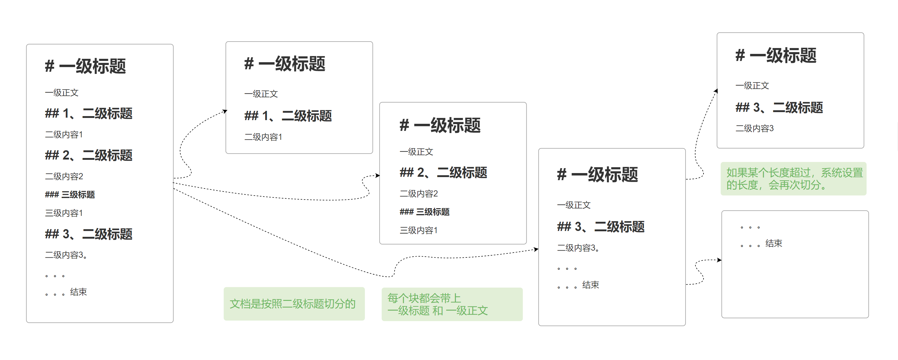

## 新建文档库
标签

## 录入

文档型知识库支持直接录入和上传文件导入：

### 直接录入

直接录入知识库文档，只需在知识库管理页面点击“新建文档”按钮，选择手工录入。

要求填写文档名称

由于服务器会在本地存放一份文档原文，文档的名称就是服务器本地文件的名称，因此文档名称不能重复。

填写文档内容

AI整理

保存 保存并同步向量库

文档切块的规则

文档具有版本管理，可以查看修改历史。

### 上传文件导入

## 向量化

单独更新向量库

批量更新向量库

## 其他
### 向量检测

### 调整类目
