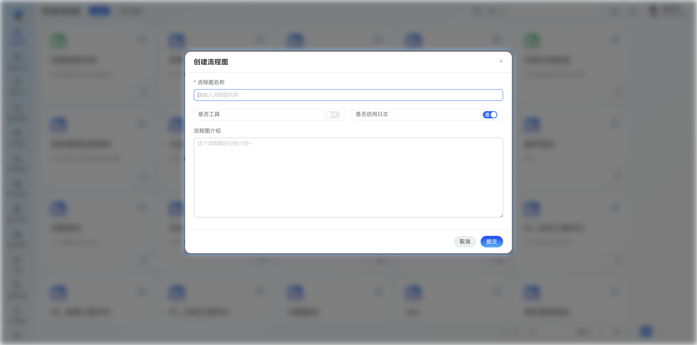

## 下载

## 安装

## 配置

<Banner changeLayout={false}>Hello World</Banner>

## demo
接下来我们将从简单的例子开始，一些复杂的流程也仅仅是这些简单例子的组合
### 1、接受和发送消息
作为第一课，我们先构建一个非常简单的流程，接受用户输入，然后发送消息给用户。

<Accordions>
  <Accordion title="创建一个最简单的流程">

    <Steps>
    <Step>
    创建一个流程
    </Step>
    <Step>
    添加一个大模型节点
    </Step>
    <Step>
    添加连接开始节点和模型节点
    </Step>
    <Step>
    为模型节点填写提示词
    </Step>
    <Step>
    运行一下
    </Step>
    </Steps>
  </Accordion>

  <Accordion title="接下来我们尝试再添加一个角色 !">

    <Steps>
    <Step>
    创建一个流程
    </Step>
    </Steps>
  </Accordion>

  <Accordion title="将 `notify` 工具换成 `terminate` 试试呢 ？">

    <Steps>
    <Step>
    修改第一个角色的提示词
    </Step>
    </Steps>
  </Accordion>

</Accordions>

### 2、简单的真心话游戏
真心话游戏的规则：有两个玩家，`玩家A` 和 `玩家B` 玩石头剪刀布，胜利者提问失败者回答问题，然后下一轮。

为了流程更加清晰，我们引入一个额外的角色： `裁判`
<Accordions>
  <Accordion title="详细规则如下">

    <Steps>
    <Step>
    首先裁判宣布比赛开始，然后A和B同时出拳
    </Step>
    <Step>
    裁判会根据A和B的出拳，判断谁是胜者
    </Step>
    <Step>
    如果A和B出了相同的拳，则裁判宣布平局，A和B继续出拳
    </Step>
    <Step>
    如果A和B出不同的拳，则裁判宣布胜者
    </Step>
    <Step>
    如果裁判宣布胜者，宣布胜者，同时要求胜利者提问
    </Step>
    <Step>
    失败者回答问题，然后下一轮
    </Step>
    </Steps>
  </Accordion>

</Accordions>

### 3、为角色配置工具

上面学习了如何创建角色，并进行角色间合作完成任务，接下来我们学习如何让角色使用工具。
<Accordions>
  <Accordion title="按照如下步骤操作">
  <Steps> 
    <Step>
    首先还是创建一个新的流程，然后添加一个大模型节点。
    </Step>
    <Step>
    接下来选中模型节点，找到 **可用工具** ，然后添加工具，下面我们为模型添加一个 计算器工具。
    </Step>
    <Step>
    编写提示词：
    </Step>
    <Step>
    运行一下，输入：帮我计算一下541除以154。
    
    测试一下计算器工具是否正常工作。
    </Step>
  </Steps> 
  </Accordion>
</Accordions>

### 4、使用ReAct
ReAct（多轮推理）是Y-Agent框架的内置工具，适用于多跳问题，例如：541除以154 和 741除以211 谁更大？
<Accordions>
  <Accordion title="使用ReAct">
  <Steps>
    <Step>
      同样我们使用例子3里面的流程，稍加改变：
    </Step>
  </Steps> 
  </Accordion>
</Accordions>

### 5、使用变量

通过上面的学习，您已经掌握了基本的流程，接下来，我们开始使用变量。 相关知识：[工作空间变量.](TODO：url) [角色变量.](TODO：url) 

### 6、工具和角色节点混排

这一节里，我们主要讲述如果将工具作为节点，并且设置固定参数、手工指定变量作为参数

### 7、接入外部WebApi

本框架可以方便的与您原有的系统集成，只需要将您的接口作为WebApi，并返回json数据即可。相关知识：[接入外部系统.](TODO：url)

### 8、进阶知识

分身、聊天室、执行器、提示词编写、编辑系统内置默认提示词、

添加测试、添加训练语料、创建并执行测试计划

添加知识库、

[用户管理. 角色管理. 权限管理](/docs/y-agent/authorization#新增用户).

[系统设置](/docs/y-agent/sys_setting).

高级知识：创建自动化流程分析工具、自动添加测试和训练语料、自动添加文档知识库

