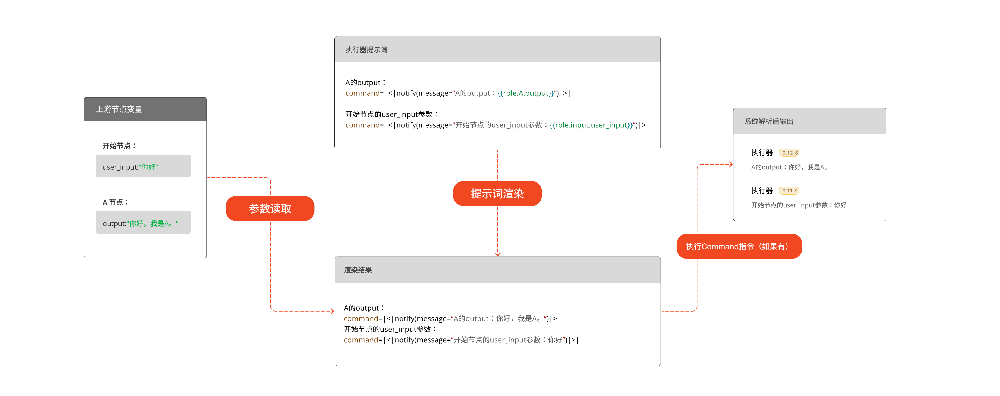

## 什么是执行器节点？
执行器是一个允许用户通过jinja模板语言，来手动出发系统函数的地方。
通过对jinja模板的合理设计，用户可调用相应的系统函数，从而完成预设的固定执行任务。

执行器的工作原理是，直接将jinja模进行渲染，然后解析结果，调用相应的系统函数。

示意图：

## 执行器节点配置

<include>../public/sys_function.mdx</include>
## 执行器使用的案例：
TODO：补充案例
<Accordions>
  <Accordion title="向用户输出消息">
    折叠展示 title="折叠展示"，id 代表链接地址
    默认展开 orientation="vertical"  
  </Accordion>
  <Accordion title="直接写入工作空间变量">
    折叠展示 title="折叠展示"，id 代表链接地址
    默认展开 orientation="vertical"  
  </Accordion>
  <Accordion title="根据固定代码逻辑，执行系统函数">
    折叠展示 title="折叠展示"，id 代表链接地址
    默认展开 orientation="vertical"  
  </Accordion>
  <Accordion title="通过代码逻辑，选择下游角色节点">
    折叠展示 title="折叠展示"，id 代表链接地址
    默认展开 orientation="vertical"  
  </Accordion>
  <Accordion title="折叠展示">
    折叠展示 title="折叠展示"，id 代表链接地址
    默认展开 orientation="vertical"  
  </Accordion>
</Accordions>