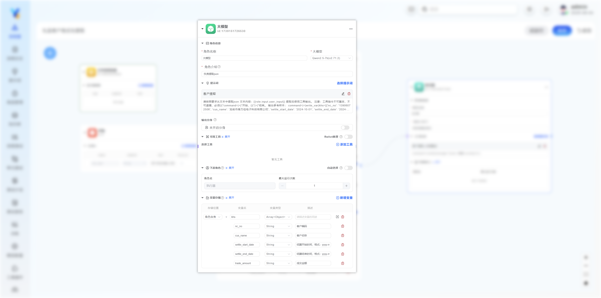

## 模型节点




<Accordions>
  <Accordion title="节点属性简要说明">
  
| 属性 | 说明 | 必填 |
| --- | --- | --- |
| 角色名称 | 角色名称 | 是 |
| 大模型 | 选择你的大模型 [如何添加模型..](TODO：url) | 是 |
| 角色介绍 | 描述这个角色的职责，如果上游角色需要自动选择下游角色，则需要在这里说明，方便大模型选择 | 是 |
| 提示词 | 大模型执行任务的提示词 [提示词编写..](../prompt_guide) | 是 |
| 输出分身 | 如果模型同时要执行：自动选择下游角色 使用工具  填写参数 中的多个任务，可以开启分身(默认开启)。 [关于输出分身介绍..](./model_node#输出分身)  |   |
| 配置工具 | 给模型添加可用工具。  [自主选择工具..](TODO：url) |   |
| ReAct推理 | 开启后模型会自动进行多轮推理（本功能和分身不能同时开启）  [ReAct推理配置..](./model_node#react推理) |   |
| 自动选择下游角色 | 开启后模型会自动选择下一步执行任务的节点，可以是多个也可以是一个  [自动选择下游角色..](./model_node#下游角色) |   |
| 存储变量 | 当需要模型输出变量时，可以添加并编写变量名称和描述  [输出变量..](./model_node#变量存储) |  |


  </Accordion>
</Accordions>

#### 提示词：
此处可以选择和编辑你需要大模型执行任务的提示词。
#### 输出分身：
将当前节点的输出结果分裂成多个输出，每个输出对应一个分身。
<include>..//public/bilocation.mdx</include>
#### 可用工具：
##### ReAct推理：

<include>../public/react.mdx</include>

添加工具：

点击添加工具按钮，选择工具，即可为模型配置可以使用的工具。

配置工具：

| 字段         | 说明 |
|--------------|---|
| 工具描述     | 提供工具的核心用途，确保模型能准确判断是否调用该工具。         |
| 参数描述     | 说明参数的含义、填写规则及注意事项，明确参数格式、取值范围，帮助模型正确生成或使用参数。         |
| 参数         | 模型需填写的具体参数值。若留空，代表有模型填写；也可以手工直接填写值或使用 Jinja模板（如 \{\{user_input}}） |

配置好的工具，无需为模型编写提示词，系统会自动根据工具描述生成提示词。效果：
```
TODO:
```


#### 下游角色：
自动选择：

开启自动选择后，系统会为模型自动拼接一段提示词，效果如下：

```
[其他提示词，省略]
.
.
.


可选角色列表：
| 角色 | 角色职责 |
|-|-|
| 角色1 | 角色1职责描述 |
| 角色2 | 角色2职责描述 |


你的职责：
根据用户意图直接选择角色
assignment 工具介绍：用于从“可选角色列表”中选择出适宜的角色，进行处理下一步任务。
assignment 工具指令：command=|<|assignment(next_roles=[{"role":"填写选择的角色","message":"填写角色的任务内容"}])|>|


```


**最大运行次数：** 由于流程可以是有向有环的，防止进入无限循环，需要设置单个节点的最大运行次数，一般不超过5次。

- 下游节点每次被选择运行，次数减一，当次数为0时，该下游节点不可以见，防止模型一直选择同一个节点。
- 注意：如果模型没有选择任何一个下游，默认下游会全部执行。

#### 变量存储：
通过点击 `新增变量` 按钮，可以为模型配置变量存储。

新增变量需要设置好如下参数：

| 字段         | 说明                                                                 |
|--------------|---|
| 存储位置     | 可以选择输出到自身的output，或者输出到工作空间         |
| 变量名       | 变量的名称，只能使用字母和数字，且不能以数字开头。最好使用确切的英文单次，便于模型准确理解。         |
| 变量描述     | 变量的描述，便于理解变量的用途，帮助模型正确填写。         |
| 变量类型     | 变量的类型，目前支持字符串、整数、浮点数、布尔值、日期、时间、日期时间。         |

配置好变量，无需为模型编写提示词，系统会自动根据变量和描述生成提示词。效果：
```
TODO:
```
<include>../public/role_output_var.mdx</include>
<include>../public/space_var_type.mdx</include>


> 注意：系统默认的提示都是可以编辑的，如果不满意效果，可以通过展开图标查看编辑。重置按钮可以恢复默认。
提示词编辑后仅在本流程内有效，不影响其他流程。

[如何编辑默认提示词？](../prompt_guide#编辑系统内置默认提示词)


